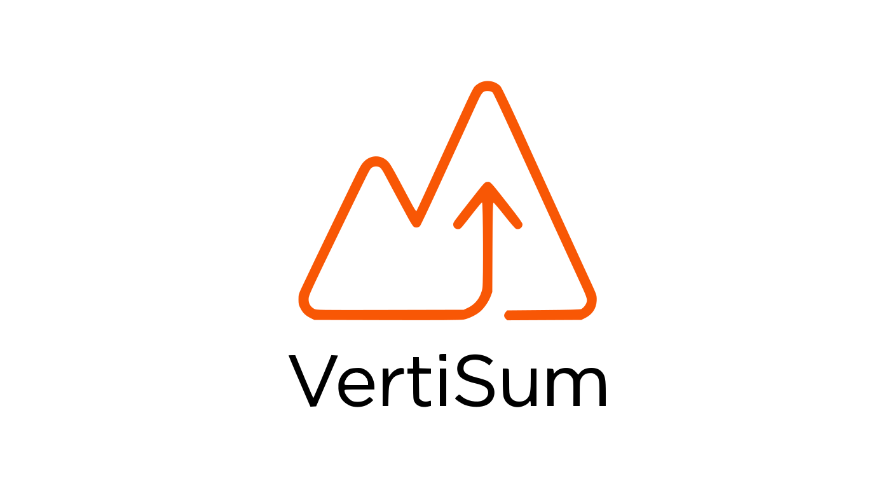

# ⛰️📈 VertiSum - Strava YTD Elevation Updater

This is a serverless webhook for Strava. It automatically updates your Strava activity descriptions with your Year-to-Date (YTD) elevation gain. Only triggers for running activities (`Run` and `TrailRun`).

## 📋 Prerequisites

You need three things to run this project:
* A GitHub account.
* A Vercel account (free tier is enough).
* A Strava account.

## ⚙️ Step 1: Create a Strava API Application

1. Go to [Strava API Settings](https://www.strava.com/settings/api).
2. Create a new application.
3. Fill in the required fields. 
4. Set **Authorization Callback Domain** to exactly `localhost`.
5. Set **Website** to whatever you want, e.g. https://google.com.
6. Click **Create**.
7. Note down your **Client ID** and **Client Secret**.

## 🔐 Step 2: Get Your Refresh Token

Your app needs permission to edit your activities. You must generate a refresh token which will be used in every call.

1. Open this URL in your browser. Replace `YOUR_CLIENT_ID` with your actual Client ID:
   ```text
   https://www.strava.com/oauth/authorize?client_id=YOUR_CLIENT_ID&response_type=code&redirect_uri=http://localhost&approval_prompt=force&scope=activity:read_all,activity:write,profile:read_all
   ```
2. Click **Authorize**.
3. You will be redirected to a broken **localhost** page. This is normal.
4. Look at the URL in your browser. Copy the **code** value from the URL parameters.
5. In your terminal run this command. Replace the placeholders with your data:
    ```bash
    curl -X POST https://www.strava.com/oauth/token \
    -F client_id="YOUR_CLIENT_ID" \
    -F client_secret="YOUR_CLIENT_SECRET" \
    -F code="YOUR_COPIED_CODE" \
    -F grant_type="authorization_code"
    ```
6. The terminal will output a JSON response. Find and save the `refresh_token`.

## 🚀 Step 3: Deploy to Vercel

The easiest way to host this webhook is using Vercel. It's free and takes just a minute.

[](https://vercel.com/new/clone?repository-url=https://github.com/branislavblazek/VertiSum&env=CLIENT_ID,CLIENT_SECRET,REFRESH_TOKEN,VERIFY_TOKEN)

1. Click the **Deploy** button above.
2. Log in to your Vercel account.
3. Vercel will ask you to clone the repository to your GitHub.
4. Fill in the required **Environment Variables**:
    * `CLIENT_ID`: Your Client ID.
    * `CLIENT_SECRET`: Your Client Secret.
    * `REFRESH_TOKEN`: The token you generated in Step 2.
    * `VERIFY_TOKEN`: Create a random password (e.g., `my-super-secret-token`).
5. Click **Deploy** and wait for the build to finish.
6. Copy your new Vercel domain (e.g., https://YOUR-PROJECT.vercel.app).

## 📡 Step 4: Register the Webhook

Strava needs to know where to send the data. You must register your Vercel URL.

1. Open your terminal.
2. Run this command. Replace the placeholders with your data:
    ```bash
    curl -X POST https://www.strava.com/api/v3/push_subscriptions \
    -F client_id="YOUR_CLIENT_ID" \
    -F client_secret="YOUR_CLIENT_SECRET" \
    -F callback_url="https://YOUR-PROJECT.vercel.app/api/webhook" \
    -F verify_token="YOUR_VERIFY_TOKEN"
    ```
3. You should receive a JSON response with a subscription `id`.
4. Your webhook is now active.

## ✅ Step 5: Test the Application

### Step 5.1: Testing with manual activity
1. Open the Strava app or website.
2. Create a manual activity.
3. Set the sport type to Run or Trail Run. Add some elevation gain.
4. Leave the description empty.
5. Save the activity.
6. Wait a few seconds. Refresh the activity page.
7. You should see your YTD elevation in the description.

### Step 5.2: Testing with old activity
1. Copy activity id of one of your activity (Trail Run or Run).
2. Run this command:
    ```bash
    curl -X POST https://YOUR-PROJECT.vercel.app/api/webhook \
    -H "Content-Type: application/json" \
    -d '{
        "aspect_type": "create",
        "object_type": "activity",
        "object_id": YOUR_ACTIVITY_ID,
        "owner_id": YOUR_OWNER_ID
    }'
    ```
3. Wait a few seconds. Refresh the activity page.
4. You should see your YTD elevation in the description.

## 🐛 Troubleshooting
- **Webhook registration fails (GET not returning 200):** Check your VERIFY_TOKEN in Vercel. Make sure it exactly matches the token in your curl command. Redeploy the project on Vercel.

- **Descriptions are not updating**: Check your Vercel Logs. Ensure your `refresh_token` has the `activity:write` scope.


## 📝 Author
Branislav Blažek, [Strava](https://www.strava.com/athletes/31650211), [Github](https://github.com/branislavblazek), 2026